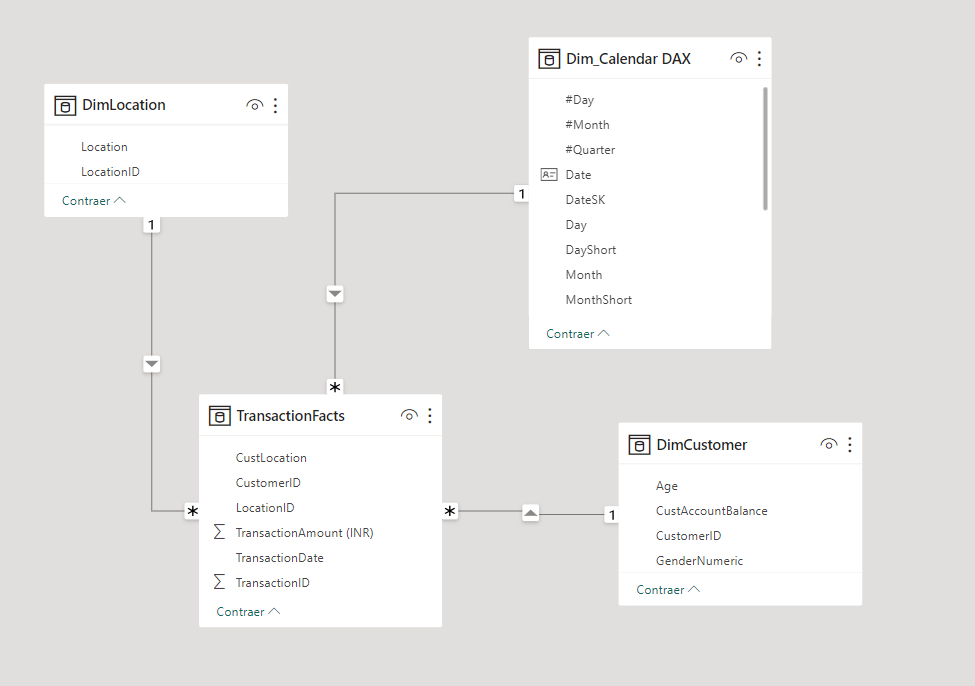

# Customer Segmentation and Lifetime Value Prediction
### **ML Zoomcamp 2023** 
#### *MIDTERM Project*
#### *Author:* Javier Blanco
**DataTalksClub**

## Run The Solution:


## 1. Introduction


## 2. Objectives


## 3. The Problem


## 4. Dataset

Dataset is about Customer demographics and transactions data from an [Indian Bank](https://www.kaggle.com/datasets/shivamb/bank-customer-segmentation/). This dataset consists of 1 Million+ transaction by over 800K customers for a bank in India. The data contains information such as - customer age (DOB), location, gender, account balance at the time of the transaction, transaction details, transaction amount, etc. Based on the features of this dataset we can develop a customer segmentation based in groups on shared traits. 


## 5. Methods and Materials

### Technical Stack
* **Google Colab**: To develop entire solution, since Exploratory Data Analysis until Model training and validation
* **Microsoft PowerQuery**: To perform ETL process, cleaning and type formatting included
* **Python 3.10**: Main programing language alongside its well-known dependencies: Pandas, Numpy, Matplotlib and Plotly.
* **Scikit-Learn**: Machine Learning library which predicted model has been created. 
* **Microsoft PowerBI**: Visualization tool to perform interactive dashboard with data segmented
* **Pipenv**: Environment library to isolate system
* **Streamlit**: Web-based tool to share model implementation as endpoint. 

### Metodology

### Features and Target

* **Features**:


## 6. Main Results

### ETL Fact Table (Transactions)

```javascript
let
    Origen = Csv.Document(File.Contents("C:\Users\javie\Documents\ML_Zoomcamp_Midterm_Project\dataset\bank_transactions.csv"),[Delimiter=",", Columns=9, Encoding=1252, QuoteStyle=QuoteStyle.None]),
    #"Encabezados promovidos" = Table.PromoteHeaders(Origen, [PromoteAllScalars=true]),
    #"Tipo cambiado" = Table.TransformColumnTypes(#"Encabezados promovidos",{{"TransactionID", type text}, {"CustomerID", type text}, {"CustomerDOB", type text}, {"CustGender", type text}, {"CustLocation", type text}, {"CustAccountBalance", Int64.Type}, {"TransactionDate", type date}, {"TransactionTime", Int64.Type}, {"TransactionAmount (INR)", Int64.Type}}),
    #"Tipo cambiado1" = Table.TransformColumnTypes(#"Tipo cambiado",{{"CustomerDOB", type date}}),
    #"Errores quitados" = Table.RemoveRowsWithErrors(#"Tipo cambiado1", {"CustomerDOB"}),
    #"Antigüedad insertada" = Table.AddColumn(#"Errores quitados", "Antigüedad", each Date.From(DateTime.LocalNow()) - [CustomerDOB], type duration),
    #"Columnas con nombre cambiado" = Table.RenameColumns(#"Antigüedad insertada",{{"Antigüedad", "Age"}}),
    #"Total de años calculados" = Table.TransformColumns(#"Columnas con nombre cambiado",{{"Age", each Duration.TotalDays(_) / 365, type number}}),
    #"Redondeado a la baja" = Table.TransformColumns(#"Total de años calculados",{{"Age", Number.RoundDown, Int64.Type}}),
    #"Filas filtradas" = Table.SelectRows(#"Redondeado a la baja", each [Age] >= 0 and [Age] < 75),
    #"Valor reemplazado" = Table.ReplaceValue(#"Filas filtradas","F","Female",Replacer.ReplaceText,{"CustGender"}),
    #"Valor reemplazado1" = Table.ReplaceValue(#"Valor reemplazado","M","Male",Replacer.ReplaceText,{"CustGender"}),
    #"Columna condicional agregada" = Table.AddColumn(#"Valor reemplazado1", "AgeNumeric", each if [CustGender] = "Male" then 0 else 1),
    #"Columnas con nombre cambiado1" = Table.RenameColumns(#"Columna condicional agregada",{{"AgeNumeric", "GenderNumeric"}}),
    #"Columnas quitadas" = Table.RemoveColumns(#"Columnas con nombre cambiado1",{"CustomerDOB", "CustGender", "TransactionTime"}),
    #"Filas filtradas1" = Table.SelectRows(#"Columnas quitadas", each [CustLocation] <> null and [CustLocation] <> ""),
    #"Filas filtradas2" = Table.SelectRows(#"Filas filtradas1", each [CustAccountBalance] <> null and [CustAccountBalance] <> ""),
    #"Texto extraído después del delimitador" = Table.TransformColumns(#"Filas filtradas2", {{"TransactionID", each Text.AfterDelimiter(_, "T"), type text}}),
    #"Columnas reordenadas" = Table.ReorderColumns(#"Texto extraído después del delimitador",{"TransactionID", "TransactionDate", "CustomerID", "TransactionAmount (INR)", "CustAccountBalance", "Age", "GenderNumeric", "CustLocation"}),
    #"Conservar filas superiores" = Table.FirstN(#"Columnas reordenadas",587657),
    #"Tipo cambiado2" = Table.TransformColumnTypes(#"Conservar filas superiores",{{"TransactionID", Int64.Type}}),
    #"Texto extraído después del delimitador1" = Table.TransformColumns(#"Tipo cambiado2", {{"CustomerID", each Text.AfterDelimiter(_, "C"), type text}}),
    #"Tipo cambiado3" = Table.TransformColumnTypes(#"Texto extraído después del delimitador1",{{"CustomerID", Int64.Type}}),
    #"Columnas quitadas1" = Table.RemoveColumns(#"Tipo cambiado3",{"CustAccountBalance", "Age", "GenderNumeric"})
in
    #"Columnas quitadas1"

```

### ETL Dim Table (Customer)

```javascript
let
    Origen = Csv.Document(File.Contents("C:\Users\javie\Documents\ML_Zoomcamp_Midterm_Project\dataset\bank_transactions.csv"),[Delimiter=",", Columns=9, Encoding=1252, QuoteStyle=QuoteStyle.None]),
    #"Encabezados promovidos" = Table.PromoteHeaders(Origen, [PromoteAllScalars=true]),
    #"Tipo cambiado" = Table.TransformColumnTypes(#"Encabezados promovidos",{{"TransactionID", type text}, {"CustomerID", type text}, {"CustomerDOB", type text}, {"CustGender", type text}, {"CustLocation", type text}, {"CustAccountBalance", Int64.Type}, {"TransactionDate", type date}, {"TransactionTime", Int64.Type}, {"TransactionAmount (INR)", Int64.Type}}),
    #"Tipo cambiado1" = Table.TransformColumnTypes(#"Tipo cambiado",{{"CustomerDOB", type date}}),
    #"Errores quitados" = Table.RemoveRowsWithErrors(#"Tipo cambiado1", {"CustomerDOB"}),
    #"Antigüedad insertada" = Table.AddColumn(#"Errores quitados", "Antigüedad", each Date.From(DateTime.LocalNow()) - [CustomerDOB], type duration),
    #"Columnas con nombre cambiado" = Table.RenameColumns(#"Antigüedad insertada",{{"Antigüedad", "Age"}}),
    #"Total de años calculados" = Table.TransformColumns(#"Columnas con nombre cambiado",{{"Age", each Duration.TotalDays(_) / 365, type number}}),
    #"Redondeado a la baja" = Table.TransformColumns(#"Total de años calculados",{{"Age", Number.RoundDown, Int64.Type}}),
    #"Filas filtradas" = Table.SelectRows(#"Redondeado a la baja", each [Age] >= 0 and [Age] < 75),
    #"Valor reemplazado" = Table.ReplaceValue(#"Filas filtradas","F","Female",Replacer.ReplaceText,{"CustGender"}),
    #"Valor reemplazado1" = Table.ReplaceValue(#"Valor reemplazado","M","Male",Replacer.ReplaceText,{"CustGender"}),
    #"Columna condicional agregada" = Table.AddColumn(#"Valor reemplazado1", "AgeNumeric", each if [CustGender] = "Male" then 0 else 1),
    #"Columnas con nombre cambiado1" = Table.RenameColumns(#"Columna condicional agregada",{{"AgeNumeric", "GenderNumeric"}}),
    #"Columnas quitadas" = Table.RemoveColumns(#"Columnas con nombre cambiado1",{"CustomerDOB", "CustGender", "TransactionTime"}),
    #"Filas filtradas1" = Table.SelectRows(#"Columnas quitadas", each [CustLocation] <> null and [CustLocation] <> ""),
    #"Filas filtradas2" = Table.SelectRows(#"Filas filtradas1", each [CustAccountBalance] <> null and [CustAccountBalance] <> ""),
    #"Texto extraído después del delimitador" = Table.TransformColumns(#"Filas filtradas2", {{"TransactionID", each Text.AfterDelimiter(_, "T"), type text}}),
    #"Columnas reordenadas" = Table.ReorderColumns(#"Texto extraído después del delimitador",{"TransactionID", "TransactionDate", "CustomerID", "TransactionAmount (INR)", "CustAccountBalance", "Age", "GenderNumeric", "CustLocation"}),
    #"Conservar filas superiores" = Table.FirstN(#"Columnas reordenadas",587657),
    #"Tipo cambiado2" = Table.TransformColumnTypes(#"Conservar filas superiores",{{"TransactionID", Int64.Type}}),
    #"Columnas quitadas1" = Table.RemoveColumns(#"Tipo cambiado2",{"TransactionID", "TransactionDate", "CustLocation"}),
    #"Duplicados quitados" = Table.Distinct(#"Columnas quitadas1", {"CustomerID"}),
    #"Duplicados quitados1" = Table.Distinct(#"Duplicados quitados", {"CustomerID"}),
    #"Texto extraído después del delimitador1" = Table.TransformColumns(#"Duplicados quitados1", {{"CustomerID", each Text.AfterDelimiter(_, "C"), type text}}),
    #"Tipo cambiado3" = Table.TransformColumnTypes(#"Texto extraído después del delimitador1",{{"CustomerID", Int64.Type}}),
    #"Duplicados quitados2" = Table.Distinct(#"Tipo cambiado3", {"CustomerID"})
in
    #"Duplicados quitados2"

```

### Data Model




## 7. Conclusion

## 8. References

* 
